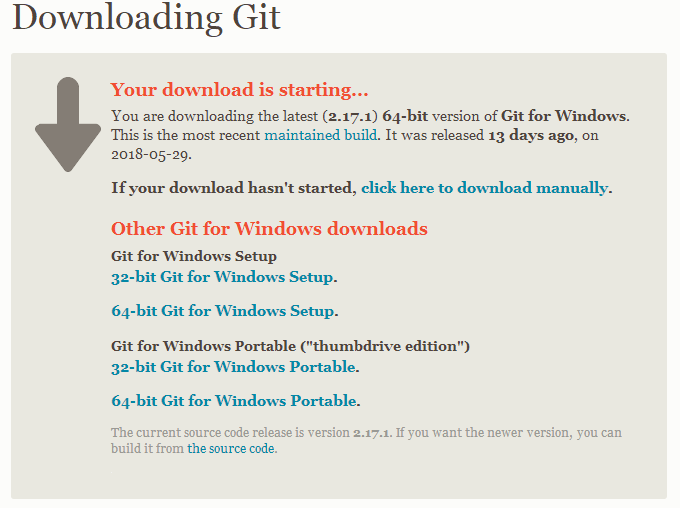
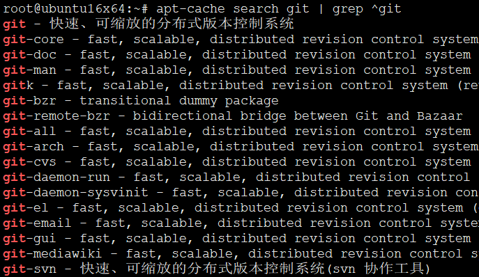
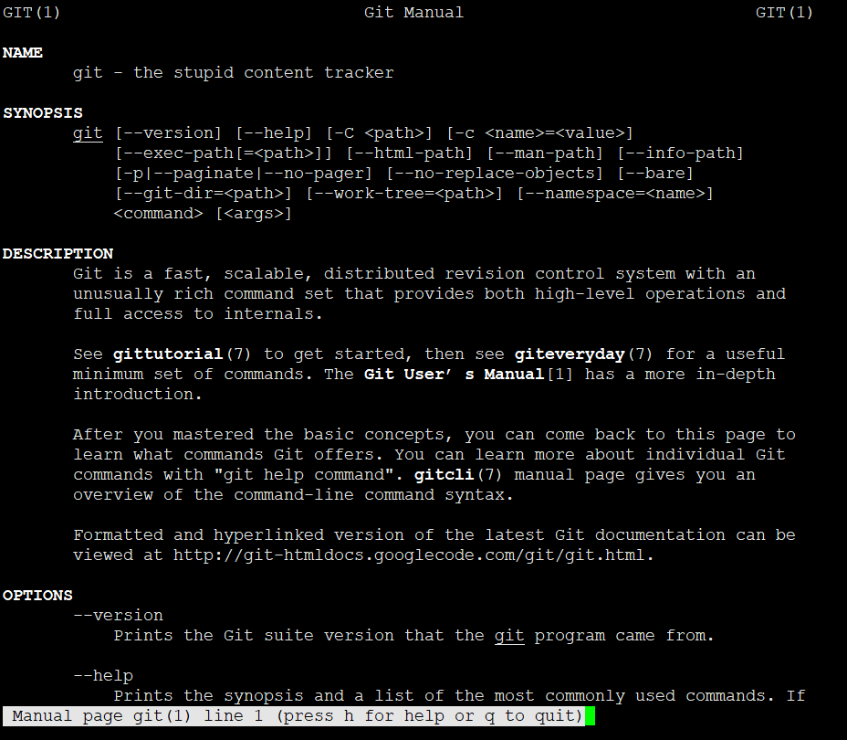
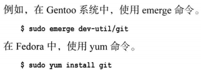
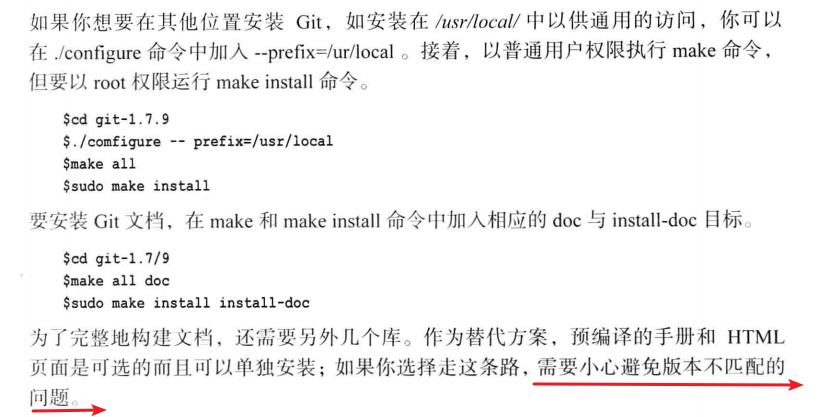

# 第2章-安装Git

## Windows平台安装

这个安装没啥好说，到Git官网<https://git-scm.com/>


网页自动检测平台，优先提供当前平台的安装包。




有便携绿色免安装版也有安装版分别提供32位64位。

## Linux平台安装

* Linux下一个软件会分成多个子包，包含一个核心包和多个扩展包。安装扩展包必定依赖核心包，也就是核心包一定会被装（如果有自动解决依赖的话）。安装核心包不一定安装所有扩展包。根据需要安装即可。
* 所以一开始先安装核心包，扩展包等有需要再说。


* Linux下包的命名也是蛋疼的一笔，变来变去，好特么烦。
* 一般先搜索一下有没有相关包,然后根据搜索到的包名进行安装，记得用慧眼过滤不必要的软件包
  * apt-cache search git
  * yum search git



```
git - 快速、可缩放的分布式版本控制系统
git-core - fast, scalable, distributed revision control system (obsolete)
git-doc - fast, scalable, distributed revision control system (documentation)
git-man - fast, scalable, distributed revision control system (manual pages)
gitk - fast, scalable, distributed revision control system (revision tree visualizer)
git-bzr - transitional dummy package
git-remote-bzr - bidirectional bridge between Git and Bazaar
git-all - fast, scalable, distributed revision control system (all subpackages)
git-arch - fast, scalable, distributed revision control system (arch interoperability)
git-cvs - fast, scalable, distributed revision control system (cvs interoperability)
git-daemon-run - fast, scalable, distributed revision control system (git-daemon service)
git-daemon-sysvinit - fast, scalable, distributed revision control system (git-daemon service)
git-el - fast, scalable, distributed revision control system (emacs support)
git-email - fast, scalable, distributed revision control system (email add-on)
git-gui - fast, scalable, distributed revision control system (GUI)
git-mediawiki - fast, scalable, distributed revision control system (MediaWiki interoperability)
git-svn - 快速、可缩放的分布式版本控制系统(svn 协作工具)
gitweb - fast, scalable, distributed revision control system (web interface)
git-annex - manage files with git, without checking their contents into git
git-big-picture - Visualization tool for Git repositories
git-build-recipe - construct a Git branch from a recipe
git-buildpackage - Suite to help with Debian packages in Git repositories
git-buildpackage-rpm - Suite to help with RPM packages in Git repositories
git-cola - highly caffeinated git GUI
git-crypt - Transparent file encryption in git
git-dpm - git Debian package manager
git-extras - Extra commands for git
git-flow - Git extension to provide a high-level branching model
git-ftp - Git powered FTP client written as shell script
git-hub - Git command line interface to GitHub
git-merge-changelog - git merge driver for GNU ChangeLog files
git-notifier - git commit email notification script
git-reintegrate - Git extension to manage integration branches
git-remote-gcrypt - encrypted git repositories
git-remote-hg - bidirectional bridge between Git and Mercurial
git-repair - repair various forms of damage to git repositories
git-restore-mtime - set timestamps to the date of a file's last commit
git-review - git command for submitting branches to Gerrit
git-sh - a git shell
git2cl - Simple tool to convert git logs to GNU ChangeLog format
gitg - git repository viewer
github-backup - backs up data from GitHub
gitinspector - statistical analysis tool for git repositories
gitit - Wiki engine backed by a git or darcs filestore
gitlab - git powered software platform to collaborate on code
gitlab-shell - handles git commands for GitLab
gitlab-workhorse - unloads Git HTTP traffic from the GitLab Rails app (Unicorn)
gitmagic - guide about Git version control system
gitolite3 - SSH-based gatekeeper for git repositories (version 3)
gitpkg - tools for maintaining Debian packages with git
gitso - simple frontend for reverse VNC connections (remote assistance)
gitstats - statistics generator for git repositories
```
* **愚蠢的内容追踪器**



```
root@ubuntu16x64:~# git --help
用法：git [--version] [--help] [-C <path>] [-c name=value]
           [--exec-path[=<path>]] [--html-path] [--man-path] [--info-path]
           [-p | --paginate | --no-pager] [--no-replace-objects] [--bare]
           [--git-dir=<path>] [--work-tree=<path>] [--namespace=<name>]
           <command> [<args>]

这些是各种场合常见的 Git 命令：

开始一个工作区（参见：git help tutorial）
   clone      克隆一个仓库到一个新目录
   init       创建一个空的 Git 仓库或重新初始化一个已存在的仓库

在当前变更上工作（参见：git help everyday）
   add        添加文件内容至索引
   mv         移动或重命名一个文件、目录或符号链接
   reset      重置当前 HEAD 到指定状态
   rm         从工作区和索引中删除文件

检查历史和状态（参见：git help revisions）
   bisect     通过二分查找定位引入 bug 的提交
   grep       输出和模式匹配的行
   log        显示提交日志
   show       显示各种类型的对象
   status     显示工作区状态

扩展、标记和调校您的历史记录
   branch     列出、创建或删除分支
   checkout   切换分支或恢复工作区文件
   commit     记录变更到仓库
   diff       显示提交之间、提交和工作区之间等的差异
   merge      合并两个或更多开发历史
   rebase     本地提交转移至更新后的上游分支中
   tag        创建、列出、删除或校验一个 GPG 签名的标签对象

协同（参见：git help workflows）
   fetch      从另外一个仓库下载对象和引用
   pull       获取并整合另外的仓库或一个本地分支
   push       更新远程引用和相关的对象

命令 'git help -a' 和 'git help -g' 显示可用的子命令和一些概念帮助。
查看 'git help <命令>' 或 'git help <概念>' 以获取给定子命令或概念的
帮助。
```

* GNU 有个工具叫（GNU Interactive Tools）也缩写为Git，这。。。




* 一定要确保版本一致，根据需要选择最新，不要盲目。但通常最新是占多数。





##
